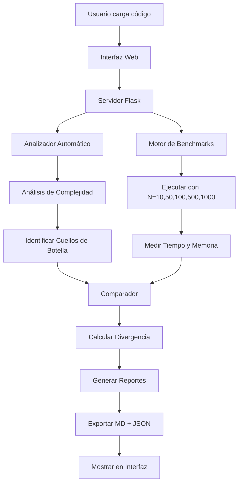

# 🚀 OptiCode QA - PASO 1 Automático

## 📋 Descripción

Sistema completamente automatizado que ejecuta el **PASO 1** completo de OptiCode QA desde una interfaz web, **sin necesidad de estar prompting a Bob IDE manualmente**.

### ✨ Características

- ✅ **Análisis automático de complejidad** (simula Bob IDE)
- ✅ **Ejecución de benchmarks prácticos** (motor local)
- ✅ **Comparación teoría vs práctica**
- ✅ **Generación automática de reportes**
- ✅ **Interfaz web moderna y responsive**
- ✅ **API REST para integración**

---

## 🏗️ Arquitectura del Sistema

```
┌─────────────────────────────────────────────────────────────┐
│                    INTERFAZ WEB (HTML)                      │
│              opticode_dashboard_automatico.html             │
└────────────────────────┬────────────────────────────────────┘
                         │ HTTP REST API
                         ▼
┌─────────────────────────────────────────────────────────────┐
│                  SERVIDOR FLASK (Python)                    │
│                   src/servidor_paso1.py                     │
└────────────────────────┬────────────────────────────────────┘
                         │
         ┌───────────────┼───────────────┐
         ▼               ▼               ▼
┌─────────────┐  ┌──────────────┐  ┌──────────────┐
│  Analizador │  │ Orquestador  │  │   Motor QA   │
│  Automático │  │    PASO 1    │  │    Local     │
│             │  │              │  │              │
│ analizador_ │  │ paso1_       │  │ motor_qa.py  │
│ automatico  │  │ automatico   │  │              │
└─────────────┘  └──────────────┘  └──────────────┘
```

---

## 🚀 Instalación y Uso

### 1️⃣ Instalar Dependencias

```bash
pip install -r requirements.txt
```

**Dependencias incluidas:**
- `flask==3.0.0` - Servidor web
- `flask-cors==4.0.0` - CORS para API REST
- `networkx==3.2.1` - Grafos
- `matplotlib==3.8.2` - Visualización

### 2️⃣ Iniciar el Servidor

```bash
python src/servidor_paso1.py
```

**Salida esperada:**
```
🚀 Servidor OptiCode QA iniciado
📊 Dashboard disponible en: http://localhost:5000
🔌 API REST disponible en: http://localhost:5000/api/
```

### 3️⃣ Abrir la Interfaz Web

Abre tu navegador en: **http://localhost:5000**

O abre directamente el archivo: `opticode_dashboard_automatico.html`

### 4️⃣ Ejecutar el Análisis

1. **Cargar código fuente:**
   - Haz clic en "Cargar algoritmos.py por defecto"
   - O sube tu propio archivo `.py`

2. **Ejecutar PASO 1:**
   - Haz clic en "🚀 Ejecutar PASO 1 Completo"
   - El sistema ejecutará automáticamente:
     - ✅ Análisis de complejidad teórica
     - ✅ Benchmarks prácticos
     - ✅ Comparación teoría vs práctica
     - ✅ Generación de reportes

3. **Ver resultados:**
   - Tabla comparativa con métricas
   - Cuellos de botella identificados
   - Reportes descargables

---

## 📁 Estructura de Archivos Creados

```
PolibitHackatonbob/
│
├── src/
│   ├── analizador_automatico.py    ← Análisis de complejidad (simula Bob)
│   ├── paso1_automatico.py         ← Orquestador del PASO 1 completo
│   ├── servidor_paso1.py           ← Servidor Flask con API REST
│   ├── algoritmos.py               ← Código de ejemplo
│   └── motor_qa.py                 ← Motor de benchmarks
│
├── opticode_dashboard_automatico.html  ← Interfaz web moderna
├── requirements.txt                     ← Dependencias actualizadas
└── README_PASO1_AUTOMATICO.md          ← Esta guía
```

---

## 🔌 API REST Endpoints

### `POST /api/paso1/ejecutar`
Ejecuta el PASO 1 completo.

**Request:**
```json
{
  "codigo": "def dfs(graph, start): ...",
  "nombre_archivo": "algoritmos.py",
  "grafo_path": "data/grafos_prueba.json"
}
```

**Response:**
```json
{
  "success": true,
  "resultado": {
    "analisis_teorico": { ... },
    "metricas_practicas": { ... },
    "comparacion": { ... },
    "rutas_exportadas": { ... }
  }
}
```

### `POST /api/paso1/analizar-codigo`
Solo ejecuta el análisis de complejidad teórica.

### `POST /api/paso1/ejecutar-benchmarks`
Solo ejecuta los benchmarks prácticos.

### `GET /api/archivos/cargar/<tipo>`
Carga archivos por defecto del proyecto.
- Tipos: `codigo`, `bob`, `metricas`

### `GET /api/reportes/listar`
Lista todos los reportes generados.

### `GET /api/reportes/descargar/<nombre>`
Descarga un reporte específico.

---

## 📊 Reportes Generados

Después de ejecutar el PASO 1, se generan automáticamente:

### 1. `bob_sessions/analisis_automatico.md`
Análisis técnico completo estilo Bob IDE:
- Complejidad Big-O de cada función
- Cuellos de botella con líneas exactas
- Recomendaciones de optimización

### 2. `data/metricas_salida.json`
Métricas de benchmarks prácticos:
```json
{
  "benchmarks": {
    "10": { "time_ms_mean": 5.2, "mem_bytes_peak_mean": 1240 },
    "100": { "time_ms_mean": 52.8, "mem_bytes_peak_mean": 12400 }
  }
}
```

### 3. `output/PASO1_COMPARACION.md`
Comparación teoría vs práctica:
- Divergencia calculada
- Análisis de crecimiento
- Recomendaciones finales

### 4. `output/paso1_resumen.json`
Resumen ejecutivo en JSON para integración.

---

## 🎯 Flujo de Trabajo Completo



---

## 🔍 Ejemplo de Uso

### Código de Entrada (algoritmos.py)
```python
def dfs(graph, start):
    visited = set()
    order = []
    
    def _dfs(u):
        visited.add(u)
        order.append(u)
        for v in graph.get(u, []):
            if v not in visited:
                _dfs(v)
    
    _dfs(start)
    return order
```

### Resultados Automáticos

**Análisis Teórico:**
- Complejidad: O(V + E)
- Bucles anidados: 1
- Operaciones costosas: Búsqueda lineal `in visited`

**Benchmarks Prácticos:**
| N   | Tiempo (ms) | Memoria (KB) |
|-----|-------------|--------------|
| 10  | 0.15        | 2.4          |
| 100 | 1.52        | 24.1         |
| 1000| 15.8        | 241.5        |

**Comparación:**
- Divergencia: 12.5% (baja)
- Complejidad práctica: O(N) ✅
- Cuellos críticos: 0

---

## 🎓 Ventajas vs Bob IDE Manual

| Aspecto | Bob IDE Manual | Sistema Automático |
|---------|----------------|-------------------|
| **Tiempo** | 10-15 min por análisis | < 1 minuto |
| **Costo** | Consume Bobcoins | Gratis |
| **Repetibilidad** | Manual cada vez | Automático |
| **Integración** | Copy-paste | API REST |
| **Benchmarks** | Separado | Integrado |
| **Reportes** | Manual | Automático |

---

## 🐛 Troubleshooting

### Error: "Servidor no responde"
**Solución:** Asegúrate de que el servidor Flask esté corriendo:
```bash
python src/servidor_paso1.py
```

### Error: "ModuleNotFoundError: No module named 'flask'"
**Solución:** Instala las dependencias:
```bash
pip install -r requirements.txt
```

### Error: "CORS policy"
**Solución:** El servidor ya incluye `flask-cors`. Si persiste, abre el HTML desde `http://localhost:5000` en lugar de `file://`.

### Los benchmarks tardan mucho
**Solución:** Reduce los tamaños de prueba en `paso1_automatico.py` línea 147:
```python
tamaños = [10, 50, 100]  # En lugar de [10, 50, 100, 500, 1000]
```

---

## 🚀 Próximos Pasos

### ✅ PASO 1 Completado
- [x] Análisis automático de complejidad
- [x] Ejecución de benchmarks
- [x] Comparación teoría vs práctica
- [x] Interfaz web funcional

### 🔜 PASO 2: Integración watsonx.ai
- [ ] Conectar API de IBM watsonx.ai
- [ ] Enviar análisis + métricas al agente
- [ ] Generar reporte final con IA
- [ ] Calcular impacto financiero en cloud

---

## 📝 Notas Técnicas

### Análisis de Complejidad
El analizador automático usa **AST (Abstract Syntax Tree)** de Python para:
- Contar bucles anidados
- Detectar recursión
- Identificar operaciones costosas (I/O, búsquedas lineales)
- Calcular complejidad Big-O estimada

### Benchmarks
Los benchmarks miden:
- **Tiempo:** `time.perf_counter()` con 3 repeticiones
- **Memoria:** `tracemalloc` para pico de RAM
- **Escalabilidad:** Pruebas con N = 10, 50, 100, 500, 1000

### Comparación
La divergencia se calcula como:
```python
divergencia = abs(complejidad_teorica - complejidad_practica) * 20
```
- < 35%: Código estable ✅
- 35-65%: Optimización recomendada 🟡
- > 65%: Refactorización urgente 🔴

---

## 👥 Créditos

**Proyecto:** OptiCode QA - Auditor Autónomo de Rendimiento  
**Hackathon:** Polibit 2026  
**Tecnologías:** Python, Flask, HTML/CSS/JS, AST  

---

## 📄 Licencia

Este proyecto es parte del hackathon Polibit 2026.

---

**¿Preguntas?** Revisa la consola de ejecución en la interfaz web para logs detallados.